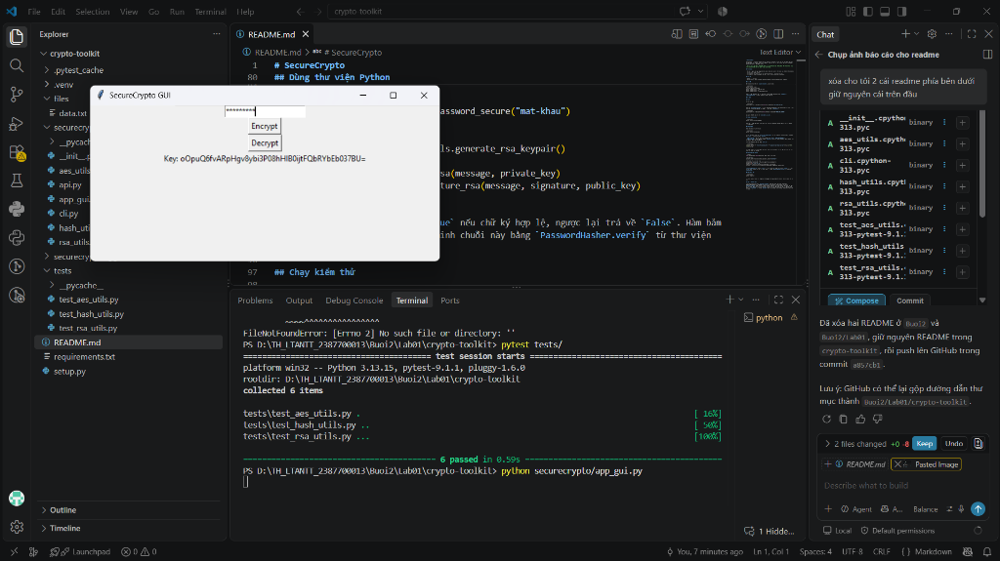
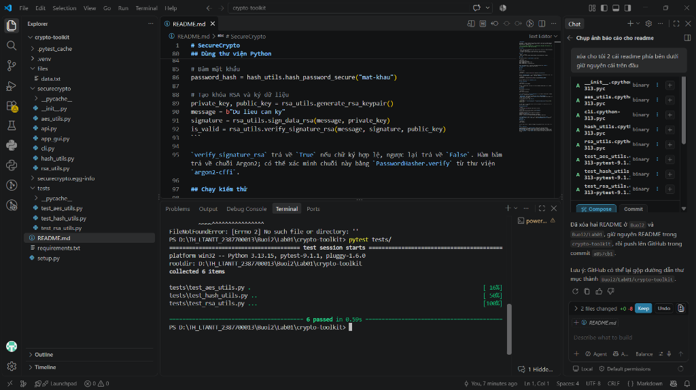

# SecureCrypto

SecureCrypto là toolkit Python cho một số thao tác mật mã cơ bản: mã hóa tệp bằng AES-GCM, băm mật khẩu với Argon2, tạo chữ ký RSA và kiểm tra chữ ký. Dự án cung cấp CLI, giao diện desktop Tkinter và API HTTP Flask.

> Đây là dự án học tập, chưa được đánh giá bảo mật độc lập. Không dùng API Flask trực tiếp trên Internet hoặc để bảo vệ dữ liệu quan trọng.
> 


## Tính năng


- Mã hóa và giải mã tệp bằng AES-GCM; khóa được dẫn xuất từ mật khẩu qua PBKDF2-HMAC-SHA256.
- Băm mật khẩu bằng Argon2.
- Tạo cặp khóa RSA 2048-bit, ký dữ liệu với SHA-256 và xác minh chữ ký.
- Sử dụng chức năng mã hóa/giải mã tệp từ CLI, Tkinter GUI hoặc Flask API.


## Yêu cầu

- Python 3.8 trở lên.
- Tkinter nếu sử dụng giao diện desktop (thường có sẵn với Python trên Windows).

## Cài đặt

Mở terminal tại thư mục `crypto-toolkit`, sau đó chạy:

```powershell
python -m venv .venv
.venv\Scripts\Activate.ps1
python -m pip install --upgrade pip
python -m pip install -e .
python -m pip install -r requirements.txt
```

Lệnh cài đặt editable lấy các thư viện runtime được khai báo trong `setup.py`; `requirements.txt` cài thêm pytest để chạy kiểm thử.

## Sử dụng

### CLI

Mã hóa một tệp:

```powershell
securecrypto-cli --encrypt files/data.txt --password "mat-khau-cua-ban"
```

Lệnh tạo `files/data.txt.enc` và in ra khóa AES dạng Base64. Lưu khóa này ở nơi an toàn. Để giải mã, truyền khóa Base64 vừa nhận vào tùy chọn `--password`:

```powershell
securecrypto-cli --decrypt files/data.txt.enc --password "KHOA_AES_BASE64"
```

Tệp giải mã được ghi thành `files/data.txt.dec`.

### Giao diện desktop

Khởi chạy ứng dụng đồ họa Tkinter:

```powershell
python -m securecrypto.app_gui
# hoặc
python securecrypto/app_gui.py
```

Chọn tệp và nhập mật khẩu để mã hóa. Khi giải mã, nhập khóa Base64 được in ra lúc mã hóa vào ô mật khẩu.

#### Minh họa hoạt động giao diện (GUI Demo)



**Báo cáo thực nghiệm giao diện:**
- **Khởi chạy ứng dụng:** Chạy tệp `securecrypto/app_gui.py`, cửa sổ đồ họa **SecureCrypto GUI** hiển thị với trường nhập mật khẩu (dạng ký tự ẩn `*`) cùng hai nút chức năng `Encrypt` và `Decrypt`.
- **Thao tác mã hóa (`Encrypt`):** Khi bấm nút `Encrypt`, ứng dụng mở hộp thoại chọn tệp tin cần bảo vệ. Sau khi chọn tệp và nhập mật khẩu, chương trình dẫn xuất khóa qua PBKDF2, mã hóa tệp bằng thuật toán AES-GCM, sinh tệp `.enc` và hiển thị khóa AES dạng Base64 trên giao diện (ví dụ: `Key: oPuQ6fvARPHgv8ybi3P08hHlB0jtFQbRYbEb037BU=`).
- **Thao tác giải mã (`Decrypt`):** Người dùng nhập khóa Base64 vừa nhận vào ô nhập liệu, bấm `Decrypt` và chọn tệp `.enc` để giải mã và phục hồi tệp gốc `.dec`.

### Flask API

Khởi chạy máy chủ phát triển:

```powershell
python -m securecrypto.api
```

Máy chủ mặc định chạy tại `http://127.0.0.1:5000`. Cả hai endpoint nhận multipart form gồm tệp `file` và trường văn bản `password`:

- `POST /encrypt`: mã hóa tệp, trả về JSON như `{"key": "KHOA_AES_BASE64"}`.
- `POST /decrypt`: giải mã tệp; trường `password` phải chứa khóa Base64 từ bước mã hóa. Trả về JSON có đường dẫn tệp đầu ra.

Ví dụ gọi endpoint mã hóa bằng `curl.exe`:

```powershell
curl.exe -X POST -F "file=@files/data.txt" -F "password=mat-khau-cua-ban" http://127.0.0.1:5000/encrypt
```

API hiện chưa có xác thực, giới hạn kích thước tải lên hay xử lý tên tệp an toàn; chỉ nên chạy cục bộ để thử nghiệm.

## Dùng thư viện Python

```python
from securecrypto import aes_utils, hash_utils, rsa_utils

# Băm mật khẩu
password_hash = hash_utils.hash_password_secure("mat-khau")

# Tạo khóa RSA và ký dữ liệu
private_key, public_key = rsa_utils.generate_rsa_keypair()
message = b"Du lieu can ky"
signature = rsa_utils.sign_data_rsa(message, private_key)
is_valid = rsa_utils.verify_signature_rsa(message, signature, public_key)
```

`verify_signature_rsa` trả về `True` nếu chữ ký hợp lệ, ngược lại trả về `False`. Hàm băm trả về chuỗi Argon2; có thể xác minh chuỗi này bằng `PasswordHasher.verify` từ thư viện `argon2-cffi`.

## Chạy kiểm thử

Dự án sử dụng `pytest` để thực hiện kiểm thử tự động (Unit Test) cho toàn bộ các module mật mã:

```powershell
python -m pytest
# hoặc
pytest tests/
```

Các test hiện có kiểm tra vòng đời mã hóa/giải mã tệp, băm mật khẩu và tạo/xác minh chữ ký RSA.

#### Báo cáo kết quả kiểm thử (Test Report)



**Chi tiết kết quả kiểm thử:**
- **Môi trường thử nghiệm:** Python 3.13.15, `pytest-9.1.1`, nền tảng Windows (`win32`).
- **Tổng số ca kiểm thử:** 6 test cases thu thập từ thư mục `tests/`.
- **Kết quả chi tiết theo module:**
  1. `tests/test_aes_utils.py` (1 test): Kiểm thử quy trình mã hóa và giải mã tệp bằng AES-GCM, đối sánh nội dung giải mã với tệp gốc đảm bảo tính toàn vẹn dữ liệu.
  2. `tests/test_hash_utils.py` (2 tests): Kiểm thử thuật toán băm mật khẩu Argon2 (hàm `hash_password_secure`), xác thực thành công với mật khẩu đúng và phát hiện/từ chối khi mật khẩu sai.
  3. `tests/test_rsa_utils.py` (3 tests): Kiểm thử sinh cặp khóa RSA 2048-bit, ký dữ liệu với SHA-256, xác minh chữ ký hợp lệ và phát hiện dữ liệu bị can thiệp/chữ ký không hợp lệ.
- **Đánh giá chung:** **6 passed in 0.59s (100% Passed)**. Tất cả các hàm mật mã cốt lõi hoạt động chính xác theo đặc tả yêu cầu, kiểm thử diễn ra trơn tru và không phát sinh lỗi ngoại lệ.


## Lưu ý về khóa AES

Trong phiên bản hiện tại, `encrypt_file_aes` nhận mật khẩu, dẫn xuất khóa bằng PBKDF2-HMAC-SHA256 với 100.000 vòng lặp rồi trả khóa dưới dạng Base64. Tuy nhiên, `decrypt_file_aes` nhận trực tiếp khóa Base64, không tự dẫn xuất khóa từ mật khẩu. Vì vậy cần giữ khóa được trả về lúc mã hóa để giải mã; chỉ nhớ mật khẩu ban đầu là chưa đủ. Tên tham số `--password` và trường `password` ở các giao diện giải mã hiện chưa phản ánh chính xác điều này.
